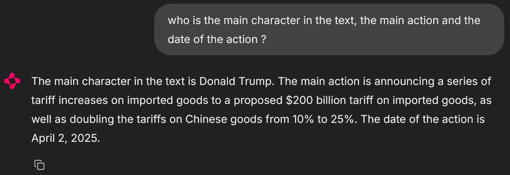

# GenAI Application

A modern, containerized GenAI application that combines Ollama, FastAPI, and Chainlit to create an intelligent chat interface with document retrieval capabilities.

By default, the system scans the frontend/data directory and adds or updates a Chroma_db database. A small text file is provided in the data directory. It contains an extract from [this Wikipedia article](https://fr.wikipedia.org/wiki/Politique_commerciale_de_la_seconde_administration_Trump).

## Screenshot


## Table of Contents

- [Features](#features)
- [Prerequisites](#prerequisites)
- [Quick Start](#quick-start)
- [Architecture](#architecture)
- [Project Structure](#project-structure)
- [Components](#components)
- [API Endpoints](#api-endpoints)
- [Troubleshooting](#troubleshooting)
- [Contributing](#contributing)
- [Acknowledgments](#acknowledgments)


## Features

- 🤖 Powered by TinyLlama model
- 📚 Document retrieval using ChromaDB
- 💬 Modern chat interface with Chainlit
- 🐳 Fully containerized with Docker
- 🔍 Semantic search capabilities

## Prerequisites

- Docker and Docker Compose installed on your computer
- At least 8GB of RAM (16GB recommended)
- 8GB of free disk space

## Quick Start

1. Clone the repository:
```bash
git clone https://github.com/berangerthomas/GenAI
cd GenAI
```

2. Start Docker desktop

3. Using a command line, navigate to the app directory, and start the application:
```bash
docker compose up --build
```

4. Wait for all downloads to finish (this can take a while).

5. Now you can access the application:
- **Chainlit**: http://localhost:8000
- Middleware API: http://localhost:8001
- Ollama API: http://localhost:11434


## Architecture

The application is built with a three-tier architecture:

1. **Backend (Ollama)**
   - Runs the Mistral model
   - Handles LLM inference
   - Exposed on port 11434

2. **Middleware (FastAPI)**
   - Acts as a proxy between frontend and backend
   - Handles request/response formatting
   - Exposed on port 8001

3. **Frontend (Chainlit)**
   - Provides a modern chat interface
   - Integrates with ChromaDB for document retrieval
   - Exposed on port 8000

   
## Project Structure

```
GenAI/
├── backend/
│   ├── Dockerfile
│   └── start.sh
├── frontend/
│   ├── Dockerfile
│   ├── main.py
│   ├── requirements.txt
│   └── chroma_db/
├── middleware/
│   ├── Dockerfile
│   ├── main.py
│   └── requirements.txt
└── docker-compose.yaml
```

## Components

### Backend (Ollama)

- Uses the official Ollama image
- Runs TinyLlama model
- Handles LLM inference requests
- Persists model data using Docker volumes

### Middleware (FastAPI)

- Proxies requests between frontend and backend
- Handles message formatting
- Provides error handling and logging
- Implements health checks

### Frontend (Chainlit)

- Modern chat interface
- Integrates with ChromaDB for document retrieval
- Uses sentence-transformers for embeddings
- Implements streaming responses

## API Endpoints

### Middleware API

- `GET /`: Health check endpoint
- `POST /api/chat`: Chat completion endpoint

### Ollama API

- `POST /api/chat`: Direct access to Ollama chat completions


## Troubleshooting

1. Check service logs:
```bash
docker-compose logs -f [service_name]
```

2. Verify service health:
```bash
docker-compose ps
```

3. Restart services:
```bash
docker-compose restart [service_name]
```

## Contributing

1. Fork the repository
2. Create a feature branch
3. Commit your changes
4. Push to the branch
5. Create a Pull Request

## Acknowledgments

- [Ollama](https://ollama.ai/) for the LLM backend
- [Chainlit](https://chainlit.io/) for the chat interface
- [ChromaDB](https://www.chromadb.com/) for vector storage
- [FastAPI](https://fastapi.tiangolo.com/) for the API middleware 
